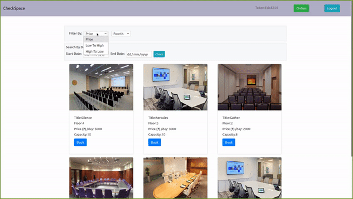
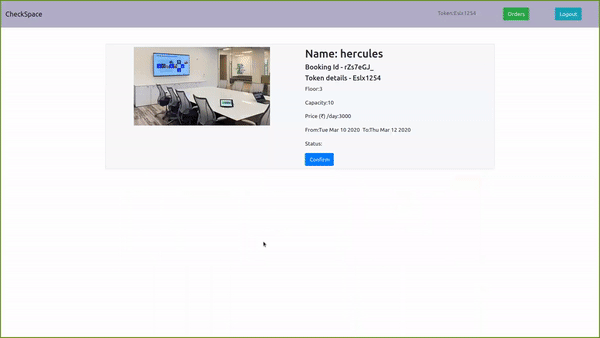

Project Name: 'CheckSpace'

Project Link: https://check-space-sagar.netlify.com/

1)User is able to sort meeting rooms based on floors and price-range

2)User is able to book meeting room based on start and end date and can view booking history.

Project Description:
'Check Space' is Meeting room booking app with below feature:
    > User can select start and end date to book particular meeting room and same room cannot be booked again in that range
    > User Can able to book meeting room based on price,capacity,floor

Used Stack: React,Redux,Css,Bootstrap,Html
